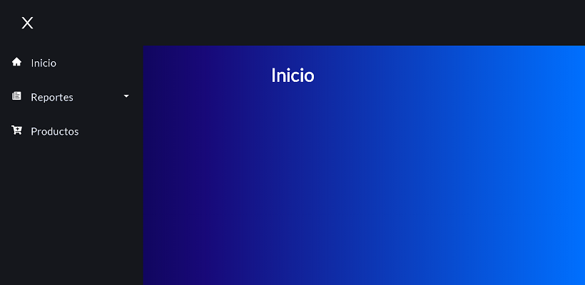

# React - Fundamentos

## Tecnologías Utilizadas:

- React (useState)
- React Router Dom (Link, BrowserRouter, Route, Routes)
- Styled Components
- ViteJs
- Git

---
## Descripción 📘 

Proyecto para entender el despliegue de un dropmenu, usando React. Se trataron temas tales como el paso de funciones y variables de un componente hacia otro, uso de routes diferenciando los componentes de las páginas y anidación de componentes para realizar el DropMenu.

---
## Vista Principal 🎨
---

